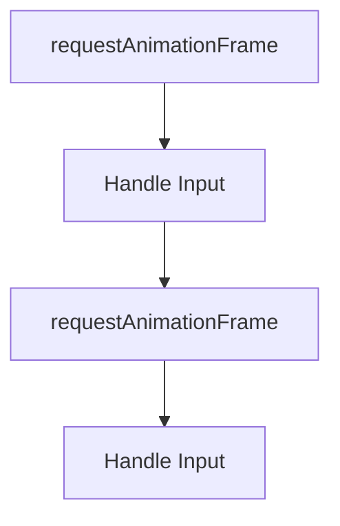
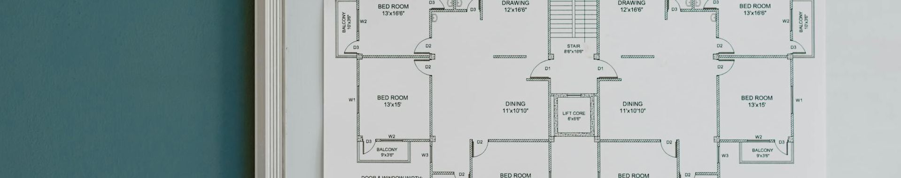
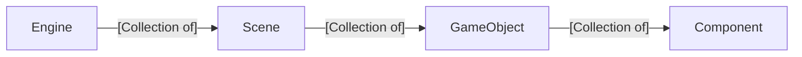

# CS 2510, Spring 2026, Topics
These are the topics we are going to cover in class each day. Links to [example student videos ](https://www.youtube.com/playlist?list=PLH9qo0GKu2iSlchbSeksN18S87gMIjHOg) and [slides from class](https://uofnebraska-my.sharepoint.com/:f:/g/personal/17816140_nebraska_edu/IgCOKBir22_NTq0uqlhKQTlNATgnX2nljSQqcI5skgvuM2A?e=A1hhjT)

---
---

# Day 04 - January 28 - Keyboard Input (🧑‍🏫Lecture 4)


## 📢Announcements
- First self-assessment/quiz next Monday
- Copy v transcribe (review AI)
- Upcoming sprint expectations
  - You can [study JS](https://javascript.info) as part of your sprint
  - You can plan the scenes, game objects, and components in your game. Just make sure you can show it to us during the sprint.
  - You can review/finish transcribing the engine. You can go through and add comments to help you understand the concepts.
  - Otherwise, work on your engine and game

## 🔙Review
- What is a Scene v Game Object v Component

> [!Tip] History Moment
>
> In 1983, there was the first video game crash. Companies has over-invested in video games, flooding the market with competing consoles. Additionally, there was no quality control on games, so developers would rush games to market that were buggy.
> This created an opening for Nintendo. The created their own console. In order to publish on the Nintendo, you had to have your game reviewed and approved by Nintendo. This meant that games were much less likely to be buggy. This, plus the improved hardware on the Nintendo, lead to a new interest in the video game market.
>
> The flagship game for the Nintendo was Super Mario Bros. which set the standard for scrolling platformers.


## 👩‍💻Activity: Code on your own -> Add a new game object
- Add an additional game object to the Day 03 code using Game Objects and Components
  - The game object should draw a triangle
  
> [!Note] FAQ: How do I add a new scene to my game?
>
> In the `game` folder, create a new file that follows this pattern:
> ```javascript
> class NewScene extends Scene{
>   constructor(){
>     super()
>     this.instantiate(new /*reference to game object class you want to instantiate*/(), new Vector2(/*location of new game object*/)) 
>     /* Continue adding game objects as needed */
>   }
> }
> ```
> ! Don't forget to add a `<script src="[scene file name].js"></src>` to your `index.html` file


> [!Note] FAQ: How do I add a new game object to my game?
>
> In the `game` folder, create a new file that follows this pattern:
> ```javascript
> class NewGameObject extends GameObject{
>   constructor(){
>     super()
>     this.addComponent(new /*reference to component class you want to add*/()) 
>     /* Continue adding components as needed */
>   }
> }
> ```
> - Don't forget to add a `<script src="[game object file name].js"></src>` to your `index.html` file
> - In order for you to see your new game object, it needs a component that draws
> - You also need to add the game object to a scene before it will be in your game

> [!Note] FAQ: How do I add a new component  to my game?
>
> In the `game` folder, create a new file that follows this pattern:
> ```javascript
> class NewComponent extends Component{
>   start(){
>     /* Code for the component when it starts*/
>   }
>   update(){
>     /* Code for the component when it update*/
>   }
>   draw(ctx){
>     /* Code for the component when it updates*/
>   }
> }
> ```
> - Don't forget to add a `<script src="[component file name].js"></src>` to your `index.html` file
> - In order for your component to be in your game, it needs to be attached to a game object that is in a scene


## 💡New Idea: Keyboard Input
- How is input handled by the computer?

- How can we capture keyboard changes?
- 🛝See slides on Input

## 👩‍💻Activity: Add Input Class to our Engine
```javascript
class Input{
  static keysDown = []

  static keyDown(event){
    Input.keysDown.push(event.code)

  }

  static keyUp(event){
    Input.keysDown = Input.keysDown.filter(k=>k!=event.code)
  }
}
```

## 👩‍💻Activity: Add Connect our Input Class to our Engine
Add the following to the `start()` function of `Engine.js`
```javascript
addEventListener("keydown", Input.keyDown)
addEventListener("keyup", Input.keyUp)
```


## 👩‍💻Activity: Keyboard Input
- Move a game object on the screen based on keyboard input
- We do this by listening for keyboard events in the `update()` function of a component
- Here is an example of what this might look like:
```javascript
 if(Input.keysDown.includes("ArrowRight"))
  this.transform.position.x += 1
    
if(Input.keysDown.includes("ArrowLeft"))
  this.transform.position.x -= 1
```


## Activity: Clean up
- We don't need most of the code in `index.html` now. 
- We can clear it out so it it just the following:
```javascript
 class Vector2 {
    constructor(x, y){
        this.x = x
        this.y = y
    }
    
    x
    y
}

Engine.currentScene = new MainScene()
Engine.start()
```

## 🤔To Think About
- Why do many games use a combination of inputs, e.g. mouse and keyboard instead of just keyboard or mouse?

## 🏁Final Code
- [The final code from Day04](https://github.com/CS2510/Spring26-Day04-Keyboard-Input)

<br/><br/>
---
---

# Day 03 - January 26 - Standard Architecture for Games (🧑‍🏫Lecture 3)


## 📢Announcements
- Upcoming sprint expectations
  - You can [study JS](https://javascript.info) as part of your sprint
  - You can plan the scenes, game objects, and components in your game. Just make sure you can show it to us during the sprint.
  - You can review/finish transcribing the engine. You can go through and add comments to help you understand the concepts.
  - Otherwise, work on your engine and game

## 🔙Review
- What is a game loop?
- What is a vector?


## 💡New Idea: Engine-specific v Game Specific
- Look at a game. For example, look at a classic [Nintendo game](https://www.retrogames.cz/play_004-Atari2600.php)
  - What parts of the game would be in all or most games? These would be engine-specific
  - What parts of the game are very specific to this game? These would be game-specific
- By separating our code into engine-specific and game-specific code, we start to create an engine. This makes it easier to create games and prepares us to use a commercial game engine.  

> [!Tip] History Moment
>
> The 1983 Mario Bros. Game (notice that it is not *Super* Mario Bros) was released by Nintendo for the Atari console. It is the first game in the Mario franchise to feature Luigi. 


## 👩‍💻Activity
- Go through the Day03 code and label the code as being engine-specific or game-specific

## 💡New Idea: Three main functions of "things" in a game
  - Start
  - Update
  - Draw

## 💡New Idea: Main Game Architectural Hierarchy
- Engine
  - An engine is a collection of scenes. 
  - An engine tracks the current scene
- Scenes (also levels or stages)
  - A scene is a collection of game objects
- Game Objects (also actors or pawns or entities)
  - A game object is a collection of components
- Components (also scripts)
  - A component has the mutable data about a game object
  - A component has the start, update and draw functions for a game object




## 👩‍💻Activity
- Create the files for engine-specific classes
  - Engine
  - Scene
  - GameObject
  - Component
- Add the start, update, and draw functions to each engine-specific class

## 👩‍💻Activity
- Create the files for game-specific classes
  - MainScene
  - BatSymbolGameObject
  - BatSymbolController
- Add the constructor, start, update, and draw functions to each game-specific class
- Rewrite the code so that the html code uses these new classes (see Final code section below).

## 👩‍💻Activity
- Look at a modern game that isn't even 2D. Where do you see Scenes, GameObjects, and Components
  


## 🤔To Think About
- Can you add a second kind objects that has a random velocity and is colored red using this architecture?

## 🏁Final Code
- This is the link for [the final code we generated on Day03](https://github.com/CS2510/Spring26-Day03-Standard-Architecture)


<br/><br/>
---
---


# Holiday - January 21 - (Class Canceled)

# Holiday - January 19 - (Class Canceled)


# Day 02 - January 14 - Game Loop (🧑‍🏫Lecture 2)


## 📢Announcements
- No class on next week

## 🔙Review
- What is the difference between the Box Model, SVG, and Canvas?
- What is the difference between the JS keyword `let` and `const`?

## Syllabus

## 💡New Idea: What is a computer game?
- In this class, a game is an enjoyable, interactive, visual simulation.
- How are we going to learn game programming?
  - Learn the math
  - Learn the architecture
  - Practice

## 💡New Idea: Repeated rendering
- requestAnimationFrame
  - 🔗Additional information:
    - [MDN website about requestAnimationFrame](https://developer.mozilla.org/en-US/docs/Web/API/Window/requestAnimationFrame)
    - [W3 Schools requestAnimationFrame](https://www.w3schools.com/jsref/met_win_requestanimationframe.asp)

## 💡New Idea: Updating our game
- MVC 
- gameLoop formalization 
  - 🔗Additional information: [A blog post about what a game loop is](https://m-abdullah-ramees0916.medium.com/the-game-loop-f6f5cb68c00)


## 💡New Idea: Vectors
- What is a vector
  - 🔗Additional information: [A Wikipedia article about Vectors](https://en.wikipedia.org/wiki/Vector_(mathematics_and_physics))
- Adding Vectors
  - 🔗Additional information: [A website about adding vectors](https://mathworld.wolfram.com/VectorAddition.html)

## 💡New Idea: Physics (Math/Simulation)
- Velocity
  - 🔗Additional information: [A Wikipedia article about Velocity](https://en.wikipedia.org/wiki/Velocity)


## 💡New Idea: Classes in JS
- classes in JS
  - 🔗Additional information: 
    - [MDN article about JS classes](https://developer.mozilla.org/en-US/docs/Web/JavaScript/Reference/Classes)
    - [W3 Schools about JS classes](https://www.w3schools.com/js/js_classes.asp)
- constructors in JS
  - 🔗Additional information:
    - [MDN article about constructors](https://developer.mozilla.org/en-US/docs/Web/JavaScript/Reference/Classes/constructor) 
    - [W3 Schools article about constructors](https://www.w3schools.com/jsref/jsref_constructor_class.asp)
- class functions in JS
- fields in JS
  - 🔗Additional information: [MDN article about class fields](https://developer.mozilla.org/en-US/docs/Web/JavaScript/Reference/Classes/Public_class_fields)

## 👩‍💻Activity
- Create a simple bouncing triangle simulation using a new Vector2 class. (See Final Code section.)

## 🤔To Think About
- Why is creative mode in Minecraft considered a game while a painting app is not?

## 🏁Final Code
- Combining classes, vectors, and our original code, we arrive at our [Day 02 Code](https://github.com/CS2510/Spring26-Day02-Animation).

## Ideas to explore on your own
- Can you change the code to make all the vertices of the triangle to have their own independent velocity?
  - Can you make the above change using arrays so that you don't need new variables for each vertex?

<br/><br/>
---
---


# Day 01 - January 12 - Introduction (🧑‍🏫Lecture 1)


## 📢Announcements
- Welcome to class
- Get a GitHub account

## 💡New Idea: Game Programming Courses at UNO
- Game Programming Course Layout:
  - ```mermaid
    graph LR
      CS2510["CS2510 Introduction to Game Programming"]-->CS3510["CS3510 Advanced Game Programming"]
      CS2510-->CS4620["CS4620 3D Computer Graphics"]
    ```
  - CS 2510, Introduction to Game Programming
    - Build a 2D game engine and a game from scratch in JavaScript
  - CS 3510, Advanced Game Programming
    - Build a 3D game using a commercial game engine (Unity) as a team
  - CS 4620, 3D Graphics
    - Understand how to create and drawing 3D assets
  
 ## 💡New Idea: Other Game Programming Resources at UNO 
 - Many students use their capstone to build something game-related
 - The art department has courses on developing 2D and 3D assets
 - Maverick Meadow in the UNO student organization focused on game development


## 🎉Course Goals
- We are going to build a 2D game engine and game in [JavaScript](javascript.info)
- So we can focus on programming, not gathering assets, our games in this class will not include:
  - Images (Including emoji)
  - Sounds
- I will be using the [VS Code IDE](https://code.visualstudio.com/) in class, but you can use any IDE
- I will be using the [Live Server](https://marketplace.visualstudio.com/items?itemName=ritwickdey.LiveServer) in VS Code, but you don't have to.
- You can see some [examples of what previous students have done on YouTube](https://www.youtube.com/playlist?list=PLH9qo0GKu2iSlchbSeksN18S87gMIjHOg)
  

  
## 💡New Idea: Macro view of methods of drawing in HTML

- Box Model
    - 
    - 🔗Addition information at:
      - [W3 Schools about the box model](https://www.w3schools.com/css/css_boxmodel.asp)
      - [MDN about the box model](https://developer.mozilla.org/en-US/docs/Learn_web_development/Core/Styling_basics/Box_model)
- SVG
    - 🔗Additional information at:
      - [MDN about SVG](https://developer.mozilla.org/en-US/docs/Web/SVG/Guides/SVG_in_HTML)
      - [W3 Schools about SVG](https://www.w3schools.com/graphics/svg_intro.asp)
- Canvas
    - 🔗Additional information at:
      - [W3 Schools about canvas](https://www.w3schools.com/html/html5_canvas.asp)
      - [MDN about canvas API](https://developer.mozilla.org/en-US/docs/Web/API/Canvas_API)


## 💡New Idea: New JS concepts

- Structure of an HTML document
  - doctype
  - html
  - head
  - body
  - script
  - Example code: [Code from the instructor showing basic HTML Structure on GitHub](https://github.com/CS2510/Day01.Drawing-Introduction/blob/main/00_html_structure.html)
  - 🔗Additional information: [W3 Schools Introduction to HTML](https://www.w3schools.com/html/html_intro.asp)

- Access elements in JS
  - 🔗Additional information: [W3 article about Query Selector](https://www.w3schools.com/jsref/met_document_queryselector.asp)

- Declaring variables in JS
  - let and const
  - Example code: [A file written by the instructor that is designed to teach about JavaScript](./JS.html)
  - 🔗Additional information: [Geeks for Geeks about let and const](https://www.geeksforgeeks.org/javascript/difference-between-var-let-and-const-keywords-in-javascript/)

- Good Introductory Websites in JS
  - [JavaScript.info Tutorial Site](https://javascript.info)
  - [W3 Schools JS tutorials](https://www.w3schools.com/js/)
  - [Geeks for Geeks JS tutorials](https://www.geeksforgeeks.org/javascript/javascript-tutorial/)

## 💡New Idea: Methods of drawing specific to canvas
- Showing color
  - See slides: 3 Ways to show Color
  - 🔗Additional information: [W3 School about named colors](https://www.w3schools.com/html/html_colors.asp)
  - 🔗Additional information: [Website about rgb and hexadecimal values](https://htmlcolorcodes.com/color-picker/)
- Paths/Polygons
  - 🔗Additional information: [Website about drawing paths](https://www.w3resource.com/html5-canvas/html5-canvas-path.php)
- Circles (Arcs)
    - Introduction to radians
- Text
  - See slides: Fonts
  - 🔗Additional information: 
      - [MDN about drawing text](https://developer.mozilla.org/en-US/docs/Web/API/Canvas_API/Tutorial/Drawing_text)
      - [W3 Schools about drawing text](https://www.w3schools.com/graphics/canvas_text.asp)
- Example code: [Code written by the instructor to show what we are learning](https://github.com/CS2510/Day01.Drawing-Introduction/blob/main/01_basic_drawing.html)


## 👩‍💻Activity
- Take what we have learned about drawing and draw something more advanced. Here are some ideas to try:
  - [Batman Logos](https://flowingdata.com/2012/12/24/evolution-of-batman-logo-1940-2012/)
  - 

## 🤔To Think About
- Use an HTML canvas to draw the basic outline of a game you like. We can call this "blocking" out a game.
- Block out a game you enjoy using the basic drawing tools we use in class. Here are some examples of the instructor blocking out the original [Super Mario Bros](https://en.wikipedia.org/wiki/Super_Mario_Bros.) game.
- Example code:
  - [Example code from the instructor showing how to block a game using arrays](https://github.com/CS2510/Day01.Drawing-Introduction/blob/main/02_blocking_a_game.html)
  - [Example code from the instructor showing how to block a game drawing "freehand" ](https://github.com/CS2510/Day01.Drawing-Introduction/blob/main/03_blocking_a_game_2.html)

## 🏁[Final Code For Day 01](https://github.com/CS2510/Day01.Drawing-Introduction/)